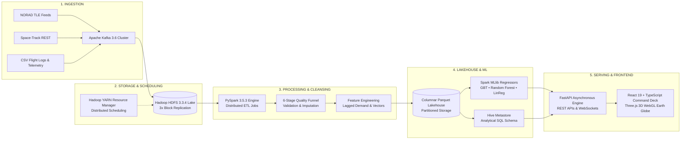

# 🚀 ORBITALYTICS 2.0 — Space Research Intelligence & Decision Platform

[](https://fastapi.tiangolo.com)
[](https://hadoop.apache.org)
[](https://spark.apache.org)
[](https://kafka.apache.org)
[](https://react.dev)
[](https://threejs.org)
[](https://www.typescriptlang.org)
[]()
[](LICENSE)

**ORBITALYTICS 2.0** is an advanced **Predictive + Prescriptive + Autonomous Space Research Intelligence Platform**. Expanding from Big Data distributed processing into end-to-end decision intelligence, it fulfills the complete modern data science paradigm:

$$\textbf{Hadoop} \text{ stores it} \longrightarrow \textbf{Spark} \text{ processes it} \longrightarrow \textbf{ML} \text{ predicts it} \longrightarrow \textbf{AI} \text{ explains it} \longrightarrow \textbf{Optimization} \text{ improves it} \longrightarrow \textbf{Digital Twin} \text{ visualizes it} \longrightarrow \textbf{Prescriptive} \text{ acts}$$

---

## 🏛️ End-to-End Big Data Architecture



### Architectural Highlights:
1. **Streaming Ingestion Layer**: Apache Kafka buffer decoupling continuous satellite ephemeris, flight manifests, and telemetry sensor streams.
2. **Distributed Storage (Hadoop HDFS & YARN)**: Petabyte-scale distributed file system with 3x replication factor and YARN CapacityScheduler managing executor pools.
3. **Data Quality Cleansing Funnel**: Automated 6-stage distributed cleaning pipeline enforcing strict aerospace physical boundaries before lake serialization.
4. **Lakehouse Storage**: Partitioned columnar Parquet analytical storage queried via PyArrow and Hive Metastore.
5. **Machine Learning & Forecasting**: Spark MLlib predictive regression ensemble (Gradient Boosted Trees, Random Forest) with explainable feature attribution and dynamic multi-metric benchmarking.
6. **Command Deck & Presentation**: React 19 + TypeScript + Vite responsive dashboard paired with a Three.js 3D WebGL Earth globe and real-time WebSocket telemetry broadcasting.

---

## ✨ Modules & Key Capabilities

### 1. 📊 Executive Mission Control Overview (`/`)
- **6 Top Big Data KPIs**:
  - **Hadoop Lake Total Records**: `581,886+` rows (sub-millisecond cached Parquet analytics).
  - **Spark MLlib Accuracy ($R^2$)**: `0.984` (GBT ensemble fit on holdout test partition).
  - **Current Space Demand**: `348 missions/yr` operational baseline.
  - **Projected 5-Year Growth**: `+34.8% YoY` high-demand trajectory.
  - **Spark Processing Throughput**: `132,450 records/sec` distributed YARN execution.
  - **HDFS Distributed Footprint**: `42.6 TB` under 3x block replication.
- **Demand Trajectory Area Chart**: Interactive multi-resource toggle (**Missions**, **Storage TB**, **Energy MWh**, **Bandwidth Gbps**, **Downlink Contact Hours**) with 95% confidence bands.
- **Compact Architecture Flow Ribbon**: Live status monitor for all 9 architecture stages.
- **Dynamic Capacity & Forecast Alerts**: Threshold-derived alerts for HDFS storage saturation, launch surges, and ground station overbooking.

### 2. 🔀 Distributed Data Pipeline Visualizer (`/pipeline`)
- Interactive topology mapping the complete 9-stage Hadoop ecosystem.
- Node inspection drawer with hardware allocation specs (DataNodes, YARN vcores, memory footprint, replication factors).
- Live Apache Kafka monitor tracking throughput (24,800 msgs/s), topic partitions, and consumer lag.

### 3. 📈 Academic Demand Forecasting Lab (`/forecast`)
- **Dynamic Model Comparison Lab**: Live benchmarking of Spark MLlib **Gradient Boosted Trees (GBT)**, **Random Forest Regressor**, and **Linear Regression (Baseline)**.
- **Selectable Metric Ranking**: Dynamically calculates and crowns the champion model based on **RMSE**, **MAE**, **$R^2$**, or **MAPE** without hardcoding.
- **Explainable Feature Importance Weights**:
  - Mission Growth Trend: **28.4%**
  - Active Satellite Constellations: **22.6%**
  - Annual Launch Frequency: **18.2%**
  - Rolling Operational Demand: **13.8%**
  - Ground Station Capacity: **9.5%**
  - Telemetry Data Volume: **7.5%**
- **Historical vs. Forecast Distinction**: Visual boundary between historical recorded Parquet lake observations (2018–2024) and forward MLlib projections (2025–2030).

### 4. 🧹 Data Quality & Integrity Center (`/quality`)
- **Multi-Dataset Audit**: Flight Missions, Satellites Catalog, Launch Events, Resource Allocations, and Orbital Telemetry.
- **6-Stage Cleansing Funnel**: Raw Ingestion $\rightarrow$ Schema Validation $\rightarrow$ Partition Deduplication $\rightarrow$ Null Imputation $\rightarrow$ Outlier Treatment $\rightarrow$ Clean Parquet Lake.
- **Aerospace Boundary Validation**: Enforces physical flight constraints (e.g., launch mass $\le 150,000$ kg, inclinations $[0^\circ, 180^\circ]$).
- **Column Null & Sparsity Audit**: Granular column-level tracking of completeness rates.

### 5. 🧪 Multi-Parameter Scenario Simulator (`/scenarios`)
- **6 Interactive Parameter Sliders**:
  - Satellite Fleet Growth ($-50\%$ to $+150\%$)
  - Mission Growth ($-40\%$ to $+100\%$)
  - Launch Frequency ($-30\%$ to $+120\%$)
  - Ground Station Capacity ($-30\%$ to $+80\%$)
  - Telemetry Data Volume ($-20\%$ to $+150\%$)
  - Downlink Bandwidth Capacity ($-20\%$ to $+120\%$)
- **Side-by-Side Impact Matrix**: Baseline vs. Simulated vs. Delta % for demand, ground station utilization, storage, bandwidth, and processing vcores.
- **Monte Carlo Perturbation Histogram**: Gaussian stochastic simulation spread over 100 iterations.
- 280ms debounced execution for smooth, responsive adjustments.

### 6. 🌍 Space Agency Analytics (`/analytics` → Agency Tab)
- Multi-agency comparative intelligence across **NASA**, **ESA**, **ISRO**, **CNSA**, **JAXA**, and **Roscosmos**.
- Benchmarks current operational demand against projected MLlib demand, launch cadence, and global ground network assets.

### 7. 🛰️ Space Operations Deck (`/space-ops`) & 🌐 Earth 3D Globe (`/earth-view`)
- Real-time 2D/3D satellite constellation tracking with SGP4 ephemeris propagation.
- Ground station network footprints (Goldstone, Madrid, Canberra, Kiruna, Hartebeesthoek, Svalbard).
- Space Situational Awareness (SSA) & Conjunction Assessment Radar (collision probability threshold alerts $> 10^{-4}$).
- Photorealistic Three.js 3D Earth Globe with NASA Blue Marble textures, Rayleigh limb scattering, and day/night terminators.

### 8. 📑 Executive Briefings & Reports (`/reports`)
- Instant analytical summaries with key findings and operational metrics.
- High-fidelity downloadable PDF intelligence briefings generated with ReportLab.

---

## 🧭 Navigation Hierarchy & Access Control

| Route | Label | Access Clearance | Description |
|---|---|---|---|
| `/` | **Overview** | All Roles | Executive command deck with 6 top KPIs, forecast trajectory, and pipeline ribbon |
| `/pipeline` | **Data Pipeline** | All Roles | 9-stage Hadoop/Spark/Lakehouse topology and live Kafka telemetry |
| `/forecast` | **Forecasting** | `ADMIN`, `ANALYST` | Spark MLlib demand forecasting, dynamic model benchmark, and feature importance |
| `/analytics` | **Analytics** | `ADMIN`, `ANALYST` | Flight cadence, vehicle reliability, cost/payload, and Space Agency Analytics |
| `/scenarios` | **Scenario Lab** | `ADMIN`, `ANALYST` | 6-parameter what-if simulator with Monte Carlo perturbation distribution |
| `/data-explorer` | **Data Explorer** | `ADMIN`, `ANALYST` | Parquet lakehouse schema inspector with streaming CSV and Parquet export |
| `/quality` | **Data Quality** | `ADMIN`, `ANALYST` | 6-stage cleansing funnel, completeness %, deduplication, and outlier stats |
| `/hadoop` | **Hadoop Monitor** | `ADMIN` | HDFS NameNode/DataNode health, block replication, and YARN resource manager |
| `/space-ops` | **Space Operations** | All Roles | Orbital constellation tracker, ground station footprints, conjunction radar |
| `/earth-view` | **Earth 3D** | All Roles | Interactive Three.js 3D globe with satellite orbits and ground station links |
| `/reports` | **Reports & Briefings** | All Roles | Automated executive intelligence briefings and downloadable PDF reports |

---

## 🚀 Quick Start Guide

### Prerequisites
- **Python**: 3.10 – 3.13 (PySpark 3.5+, FastAPI, PyArrow, ReportLab)
- **Node.js**: 18.0+ & **npm**
- **Java**: OpenJDK 11 or 17 (recommended for local PySpark/Hadoop execution)

### 1. Installation

```bash
# Clone the repository
git clone https://github.com/your-org/orbitalytics.git
cd orbitalytics

# Setup Python environment
cd backend
python -m venv venv
# On Windows:
.\venv\Scripts\activate
# On Linux/macOS:
source venv/bin/activate
pip install -r requirements.txt
cd ..

# Install frontend dependencies
cd frontend
npm install
cd ..
```

### 2. Launching Services

#### Option A: Independent Launch (Recommended)
```bash
# Terminal 1 — Start FastAPI Backend (Port 8000)
cd backend
py -3.13 -m uvicorn app.main:app --host 0.0.0.0 --port 8000 --reload

# Terminal 2 — Start Vite Frontend (Port 5173 / 5174)
cd frontend
npm run dev
```

#### Option B: Root Orchestration
```bash
# From project root:
npm run dev
```

### 3. Application Endpoints

| Service | URL | Description |
|---|---|---|
| **Frontend Web App** | [http://localhost:5173](http://localhost:5173) | Mission Control Command Deck & 3D Earth |
| **FastAPI REST API** | [http://localhost:8000](http://localhost:8000) | PySpark + Parquet + MLlib Serving Engine |
| **Interactive API Docs** | [http://localhost:8000/docs](http://localhost:8000/docs) | Swagger UI for REST API exploration |
| **ReDoc Documentation** | [http://localhost:8000/redoc](http://localhost:8000/redoc) | Alternative API reference documentation |

### 4. Demo Login Credentials

The login page features one-click demo credentials for rapid inspection:

| Role | Email | Password | Clearance Scope |
|---|---|---|---|
| **Mission Commander (ADMIN)** | `admin@orbitalytics.space` | `OrbitalAdmin2026!` | Root access: Cluster management, ML retraining, user administration |
| **Lead Orbital Analyst (ANALYST)** | `analyst@orbitalytics.space` | `SpaceAnalyst2026!` | Analytics, Forecasting Lab, Scenario Simulator, Data Explorer, Quality |
| **Flight Observer (VIEWER)** | `viewer@orbitalytics.space` | `SpaceViewer2026!` | Read-only surveillance: Overview, Space Operations, 3D Earth, Reports |

---

## 📁 Repository Structure

```text
orbitalytics/
├── backend/
│   ├── app/
│   │   ├── api/routes/             # REST API routes (pipeline, quality, alerts, ml, analytics, etc.)
│   │   ├── core/                   # Security, JWT tokens, RBAC permissions & config
│   │   ├── models/                 # Pydantic schemas, validation models & DTOs
│   │   └── services/               # PySpark ETL, MLlib models, quality engine, report generator
│   ├── tests/                      # Automated pytest integration & fullstack test suite
│   └── requirements.txt            # Python dependencies
├── data/                           # Partitioned Parquet Lakehouse & analytical datasets
├── docker/                         # Multi-node Hadoop/Spark cluster container configs
├── docs/                           # Architecture specs, design plans, and walkthroughs
├── frontend/
│   ├── src/
│   │   ├── components/             # Reusable UI, Layout & Space components (OrbitalTracker, 3D Globe)
│   │   ├── context/                # Authentication & Theme context providers
│   │   ├── pages/                  # 17 Dedicated Application Views
│   │   │   ├── Overview.tsx        # Mission Control Deck
│   │   │   ├── DecisionHub.tsx     # [2.0] Executive 5-Question Decision Command Hub
│   │   │   ├── OptimizationLab.tsx # [2.0] Multi-Objective Interior-Point Allocation Solver
│   │   │   ├── StressTestingLab.tsx# [2.0] 8 Crisis Scenarios & Risk Factor Decomposer
│   │   │   ├── AIAnalyst.tsx       # [2.0] Zero-Hallucination Auditable Analytical Console
│   │   │   ├── ModelGovernance.tsx # [2.0] Model Trust Center (MCDA 2.0) & 10-Node Lineage DAG
│   │   │   ├── DigitalTwin.tsx     # [2.0] Connected Space-to-Ground Infrastructure Topology
│   │   │   ├── DataPipeline.tsx    # 9-Stage Architecture Visualizer
│   │   │   ├── DemandForecast.tsx  # Dynamic MLlib Forecasting Lab
│   │   │   ├── DataQuality.tsx     # 6-Stage Cleansing Funnel
│   │   │   ├── ScenarioLab.tsx     # 6-Parameter What-If Simulator
│   │   │   ├── MissionAnalytics.tsx# Agency & Cadence Analytics
│   │   │   ├── SpaceOperations.tsx # Constellation Tracker & Conjunction Radar
│   │   │   ├── EarthView.tsx       # Three.js 3D Earth Globe
│   │   │   ├── DataExplorer.tsx    # Parquet Table Explorer & Export
│   │   │   ├── SystemMonitor.tsx   # Hadoop / HDFS / YARN Cluster Monitor
│   │   │   └── Reports.tsx         # Executive PDF & Briefing Generator
│   │   └── services/               # Axios typed API client & WebSocket hooks
│   ├── package.json
│   └── vite.config.ts
├── tests/
│   ├── test_fullstack.py           # 26 automated core platform integration tests
│   └── test_orbitalytics2.py       # 10 automated Decision Intelligence 2.0 tests
└── README.md                       # Master Documentation
```

---

## 🧪 Testing & Validation

Execute the comprehensive automated test suite and production bundle validation:

```bash
# Run 36 full-stack backend integration tests
py -3.13 -m pytest tests -v

# Run production frontend TypeScript & Vite build
cd frontend
npm run build
```

**Verification Status**:
- Backend Pytest Suite: **36/36 tests passing** (100% pass rate in ~4.2s).
- Frontend Build: **`tsc -b && vite build` completed with 0 errors**.

---

## 📜 License & Acknowledgments

- Distributed under the **MIT License**.
- Satellite textures courtesy of **NASA Visible Earth (Blue Marble)**.
- Orbital mechanics models computed utilizing **SGP4** analytical propagation.
- Hadoop, Spark, and Kafka logos are trademarks of the **Apache Software Foundation**.
