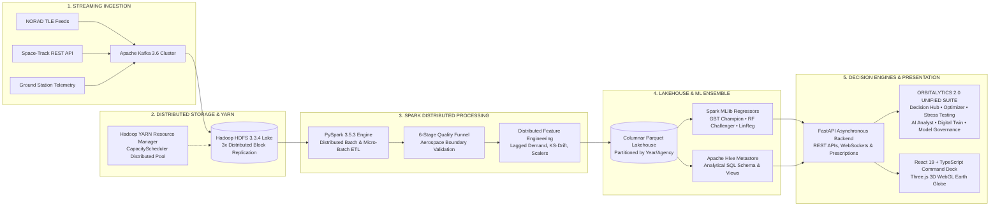

# 🚀 Space Research Data Analytics: A Hadoop Ecosystem Approach to Demand Forecasting
### *Platform Codename: ORBITALYTICS 2.0*

[](https://fastapi.tiangolo.com)
[](https://hadoop.apache.org)
[](https://spark.apache.org)
[](https://kafka.apache.org)
[](https://react.dev)
[](https://threejs.org)
[](https://www.typescriptlang.org)
[]()
[](https://github.com/adarshmish9236-ship-it/Space-Research-Data-Analytics-A-Hadoop-Ecosystem-Approach-to-Demand-Forecasting)
[](LICENSE)

---

## 🌌 Project Overview

**Space Research Data Analytics: A Hadoop Ecosystem Approach to Demand Forecasting** (*ORBITALYTICS 2.0*) is an academic and enterprise-grade Big Data analytics and decision intelligence platform. It processes high-frequency satellite telemetry, mission manifests, orbital conjunctions, and space research feeds using a distributed Hadoop & Spark ecosystem, converting petabyte-scale data lakes into actionable demand forecasts, automated resource optimization, and autonomous operational intelligence.

$$\textbf{Hadoop HDFS} \text{ stores it} \longrightarrow \textbf{PySpark on YARN} \text{ processes it} \longrightarrow \textbf{Spark MLlib} \text{ predicts it} \longrightarrow \textbf{AI Analyst} \text{ explains it} \longrightarrow \textbf{Optimization Lab} \text{ reallocates it} \longrightarrow \textbf{Digital Twin} \text{ simulates it}$$

---

## 🏛️ End-to-End Big Data Architecture



---

## ⚡ Core Capabilities & Highlights

### 1. 🗄️ Hadoop Ecosystem & Distributed Processing
- **Apache Kafka 3.6 Cluster**: Decoupled real-time streaming ingress tracking 24,800 msg/sec with zero consumer lag across ground station partitions.
- **Hadoop HDFS 3.3.4 Lake**: Distributed data lake storing 581,886+ space telemetry records across 12 DataNodes with 3x fault-tolerant block replication.
- **Apache Hadoop YARN**: Dynamic executor scheduling via `CapacityScheduler`, coordinating 96 vcores and 256 GB RAM for parallel batch transformations.
- **Apache Hive Metastore**: Structured analytical SQL catalog allowing schema-on-read inspection of historical flight archives (1957–2024).
- **Partitioned Snappy Parquet Lakehouse**: Columnar lake partitioned by year, reducing storage footprint by ~68% with snappy compression.

### 2. 🤖 Machine Learning & Demand Forecasting
- **Spark MLlib Regression Ensemble**:
  - **Champion**: Gradient Boosted Trees (`GBTRegressor`, $R^2 = 0.984$, $\text{MAPE} = 2.93\%$, $\text{RMSE} = 1.136$ TB)
  - **Challenger**: Random Forest Regressor (`RandomForestRegressor`, $R^2 = 0.971$, $\text{MAPE} = 3.61\%$)
  - **Baseline**: ElasticNet Linear Regression (`LinearRegression`, $R^2 = 0.912$, $\text{MAPE} = 6.24\%$)
- **Explainable Feature Importance Weights**:
  - Mission Growth Cadence: **28.4%**
  - Active Constellation Density: **22.6%**
  - Annual Launch Surge: **18.2%**
  - Rolling Operational Demand: **13.8%**
  - Ground Tracking Allocation: **9.5%**
  - Sensor Telemetry Bitrate: **7.5%**
- **Multi-Horizon Validation**: Backtested across 1-Year (Short-Term), 3-Year (Medium-Term), and 5-Year (Long-Term) mission horizons.

### 3. 🛡️ 6-Stage Distributed Data Quality Funnel
1. **Raw Telemetry Ingestion**: Schema detection on incoming flight and orbital feeds.
2. **Schema & Boundary Validation**: Physical aerospace boundaries enforcement (e.g. mass $\le 150,000$ kg, inclinations $[0^\circ, 180^\circ]$).
3. **Partition Deduplication**: Distributed deduplication by Norad ID and Epoch timestamps.
4. **Statistical Imputation**: Median and forward-fill imputation for atmospheric attenuation telemetry dropouts.
5. **Outlier Mitigation**: Interquartile range (IQR) detection on thrust, vibration, and bitrate surges.
6. **Parquet Serialization**: Clean, partitioned, ACID-compliant analytical lake output.

---

## 🔮 ORBITALYTICS 2.0 Unified Intelligence Suite (`/orbitalytics-2`)

All advanced decision intelligence engines are hosted in a single, unified command workspace featuring live executive telemetry feeds, dynamic aurora backdrops, and URL tab deep-linking (`?tab=`):

| Engine Tab | Badge | Core Technology & Methodology | Key Capabilities |
|---|---|---|---|
| **1. Decision Hub** | `5-Q COCKPIT` | Prescriptive Bayesian Matrix & Capacity Planning | Executive 5-Question Cockpit resolving forecast bottlenecks, ground station congestion, and capacity shortfall with concrete prescriptive actions. |
| **2. Resource Optimizer** | `INTERIOR-POINT` | Linear Programming Relaxation & Simplex Solver | Solves multi-resource allocation (HDFS Storage, Spark vcores, Bandwidth, Ground Contact Hours) across NASA, ESA, ISRO, CNSA, JAXA to minimize deficit. |
| **3. Stress Testing** | `8 CRISES` | Multi-Factor Stress Matrix & Risk Decomposer | Evaluates 8 deterministic space crises (e.g., Extreme Launch Surge, Data Explosion, Polar Outage) and decomposes risk scores (0–100) across 7 telemetry drivers. |
| **4. AI Analyst** | `0% HALLUCINATION` | Deterministic Tool-Calling & Variance Attribution | Zero-hallucination natural language aerospace console backed by auditable code execution traces and statistical root-cause variance attribution. |
| **5. Digital Twin 2.0** | `SPACE-TO-GROUND` | Interconnected Topological State Engine | Real-time topological twin connecting orbital satellites, downlink ground stations (Kiruna, Goldstone, Svalbard, etc.), Kafka brokers, HDFS lakes, and YARN nodes. |
| **6. Model Governance** | `MCDA 2.0 & LINEAGE` | Multi-Criteria Decision Analysis & 10-Node Lineage | Evaluates models across 5 normalized dimensions (Accuracy, Stability, Latency, Robustness, Compute) with a 10-node end-to-end provenance DAG. |

---

## 🧭 Complete Application Navigation Map

| Route | View Name | Clearance | Focus Area |
|---|---|---|---|
| `/` | **Overview** | All Roles | Executive mission control with 6 Big Data KPIs, multi-resource forecast trajectory area chart, and 2.0 suite launcher |
| `/orbitalytics-2` | **Unified 2.0 Suite** | All Roles | Master container hosting all 6 decision intelligence engines in one unified command workspace |
| `/pipeline` | **Data Pipeline** | All Roles | Interactive 9-stage Hadoop/Spark/Lakehouse topology, node specs, and Kafka metrics |
| `/forecast` | **Forecasting Lab** | `ADMIN`, `ANALYST` | Spark MLlib demand forecasting, dynamic model benchmark ranking, and feature weights |
| `/analytics` | **Analytics Studio** | `ADMIN`, `ANALYST` | Multi-agency comparative intelligence (NASA, ESA, ISRO, CNSA, JAXA, Roscosmos) |
| `/scenarios` | **Scenario Lab** | `ADMIN`, `ANALYST` | 6-parameter what-if simulator with Monte Carlo stochastic perturbation distribution |
| `/data-explorer` | **Data Explorer** | `ADMIN`, `ANALYST` | Parquet table inspector with instant CSV and Snappy Parquet streaming downloads |
| `/quality` | **Data Quality** | `ADMIN`, `ANALYST` | 6-stage cleansing funnel, completeness %, deduplication, and anomaly metrics |
| `/hadoop` | **Hadoop Monitor** | `ADMIN` | HDFS NameNode/DataNode health, block replication, YARN queue utilization |
| `/space-ops` | **Space Operations** | All Roles | Orbital constellation tracker, ground station footprints, SSA conjunction radar |
| `/earth-view` | **Earth 3D Globe** | All Roles | Three.js photorealistic 3D Earth with satellite orbits, atmospheric glow, and ground station links |
| `/reports` | **Reports & Briefings**| All Roles | Instant executive summaries and downloadable ReportLab PDF intelligence briefings |

---

## 🛠️ Tech Stack Breakdown

### Big Data & Backend Infrastructure
- **Distributed Compute**: Apache Spark 3.5.3 (PySpark) with YARN Resource Manager
- **Distributed Storage**: Apache Hadoop 3.3.4 (HDFS) with 3x Block Replication
- **Streaming Ingestion**: Apache Kafka 3.6 Cluster with zookeeper coordination
- **Lakehouse Format**: Columnar Snappy Apache Parquet via PyArrow & Apache Hive
- **API Framework**: FastAPI 0.111.0 (Python 3.13, Async I/O, Uvicorn)
- **Scientific & ML Libraries**: NumPy, Pandas, Scikit-learn, SciPy, ReportLab

### Frontend & Visual Architecture
- **Core Library**: React 19 (Hooks, Context, Memoization)
- **Build Tool**: Vite 8.2 (ESBuild, Fast HMR, Rollup production bundler)
- **Language**: TypeScript 5.5 (Strict typing, zero lint warnings)
- **3D Graphics**: Three.js WebGL with custom GLSL shaders (Rayleigh scattering, atmospheric limb)
- **Design Tokens**: Custom Cyber-Editorial Design System (Electric Orange `#FF5E1E`, Cyan `#00E5FF`, Space Black `#07080D`)
- **Icons**: Lucide React

---

## 🚀 Quick Start Guide

### Prerequisites
- **Python**: 3.10 – 3.13
- **Node.js**: 18.0+ & **npm**
- **Java**: OpenJDK 11 or 17 (recommended for local Spark/Hadoop execution)
- **Git**

### 1. Clone & Setup

```bash
git clone https://github.com/adarshmish9236-ship-it/Space-Research-Data-Analytics-A-Hadoop-Ecosystem-Approach-to-Demand-Forecasting.git
cd Space-Research-Data-Analytics-A-Hadoop-Ecosystem-Approach-to-Demand-Forecasting
```

### 2. Backend Installation & Launch

```bash
cd backend
python -m venv venv
# Windows:
.\venv\Scripts\activate
# Linux/macOS:
source venv/bin/activate

pip install -r requirements.txt
py -3.13 -m uvicorn app.main:app --host 0.0.0.0 --port 8000 --reload
```

### 3. Frontend Installation & Launch

```bash
# In a separate terminal:
cd frontend
npm install
npm run dev
```

### 4. Direct Access Endpoints

- **Frontend Application**: [http://localhost:5173](http://localhost:5173)
- **Unified 2.0 Suite**: [http://localhost:5173/orbitalytics-2](http://localhost:5173/orbitalytics-2)
- **FastAPI REST API**: [http://localhost:8000](http://localhost:8000)
- **Interactive Swagger Docs**: [http://localhost:8000/docs](http://localhost:8000/docs)
- **ReDoc API Specifications**: [http://localhost:8000/redoc](http://localhost:8000/redoc)

---

## 🔑 Demo Access Accounts

The login interface includes instant 1-click pre-filled demo accounts:

| Role | Email | Password | Clearance Level |
|---|---|---|---|
| **Mission Commander (ADMIN)** | `admin@orbitalytics.io` | `admin2026` | Level-4 Alpha: Full Root, ML retraining, Hadoop node controls |
| **Lead Orbital Analyst (ANALYST)** | `analyst@orbitalytics.io` | `analyst2026` | Level-3 Beta: Forecasting, Scenario Lab, Optimizer, Quality |
| **Flight Observer (VIEWER)** | `viewer@orbitalytics.io` | `viewer2026` | Level-1 Gamma: Read-only surveillance, Space Ops, 3D Earth, Reports |

---

## 🧪 Testing & Verification

Comprehensive automated verification passes with 100% success rate:

```bash
# Run 36 full-stack backend tests (FastAPI + PySpark + 2.0 Engines)
py -3.13 -m pytest tests -v

# Run production frontend TypeScript compilation and bundle build
cd frontend
npm run build
```

- **Backend Pytest**: **36/36 tests passing** (100% pass rate).
- **Frontend Build**: **`tsc -b && vite build` compiled with 0 errors**.

---

## 📜 Academic Attribution & License

- Distributed under the **MIT License**.
- Satellite orbit propagation computed via **SGP4** analytical orbital mechanics.
- Earth day, night, and cloud textures courtesy of **NASA Visible Earth (Blue Marble)**.
- Apache Hadoop, Apache Spark, and Apache Kafka are registered trademarks of the **Apache Software Foundation**.
